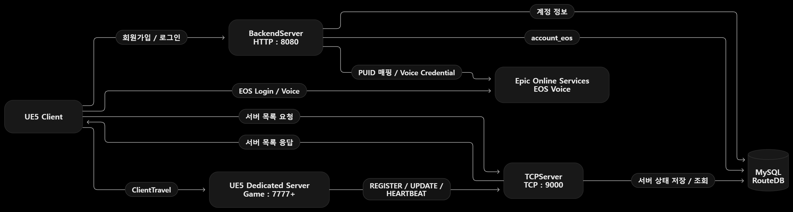
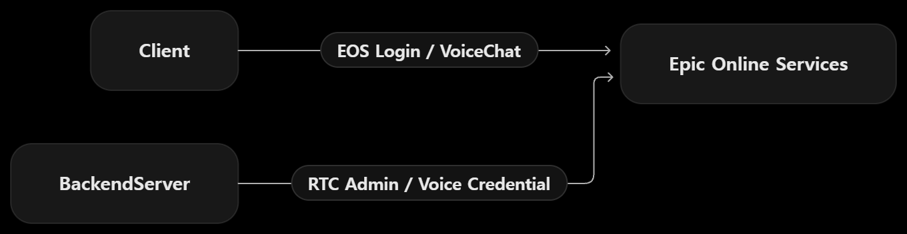

# Route

## 1. 프로젝트 소개

Unreal Engine 5의 Dedicated Server 기반 멀티플레이 구조를 직접 구성하며  
Client, Dedicated Server, Backend Server, DB 간의 통신 흐름을 이해하기 위해 진행한 개인 프로젝트입니다.

서버 등록/조회/접속, 플레이어 상태 동기화, EOS Voice 연동까지 단계적으로 구현했습니다.

## 2. 프로젝트 정보

- 개발 기간: 2026.06 ~ 2026.09
- 개발 인원: 1인
- 개발 환경: Unreal Engine 5.4 / C++ / Visual Studio 2022

## 3. 기술 스택

- Unreal Engine 5.4
- C++
- Winsock
- cpp-httplib
- MySQL
- MySQL Connector/C++
- Epic Online Services

## 4. 실행 구조

### 실행 순서

1. MySQL 실행
2. BackendServer 실행
3. TCPServer 실행
4. Dedicated Server 실행
5. Client 실행
6. 로그인 후 서버 목록 조회
7. 서버 선택 후 Dedicated Server 접속

### 사용 포트

| 구성 요소 | 포트 |
| --- | --- |
| MySQL | 3306 |
| BackendServer | 8080 |
| TCPServer | 9000 |
| Dedicated Server | 7777+ |

## 5. 시스템 아키텍처

Route는 Client, BackendServer, TCPServer, Dedicated Server를 분리하여
각 서버가 담당하는 역할에 따라 통신하도록 구성했습니다.

### 구성 요소 역할

**UE5 Client**
- 회원가입 / 로그인 요청
- 서버 목록 요청 및 응답 수신
- 선택한 Dedicated Server로 `ClientTravel`
- EOS 로그인 및 Voice 사용

**BackendServer**
- HTTP 기반 회원가입 / 로그인 처리
- 계정 정보 관리
- EOS PUID 매핑
- Voice Credential 요청 처리

**TCPServer**
- Dedicated Server 등록 및 상태 갱신
- Client의 서버 목록 요청 처리
- `REGISTER / UPDATE / HEARTBEAT` 처리
- 서버 상태 정보를 MySQL에 저장 / 조회

**UE5 Dedicated Server**
- 실제 멀티플레이 게임 세션 실행
- 플레이어 접속 / 종료 관리
- 최대 인원 관리
- TCPServer에 서버 상태 전달

**MySQL**
- 계정 정보 저장
- `account_eos` 매핑 정보 저장
- Dedicated Server 상태 정보 저장

**Epic Online Services**
- EOS 로그인
- PUID 제공
- EOS Voice 통신 처리

### EOS Voice 구조

  

- Client는 EOS Login 및 VoiceChat을 사용합니다.
- BackendServer는 RTC Admin을 통해 Voice Credential 발급을 처리합니다.
- Client와 BackendServer가 각각 EOS와 통신하여 Voice Room 참여를 구성합니다.

## 6. 핵심 구현

### Dedicated Server 등록 및 서버 목록 관리

Dedicated Server 시작 시 서버 정보를 TCPServer에 등록합니다.

Client는 `GameInstance`에서 서버 목록을 요청하고,
응답받은 JSON을 파싱하여 서버 목록 UI에 전달합니다.

사용자가 서버를 선택하면 IP와 Port를 이용해
`ClientTravel()`로 해당 Dedicated Server에 접속합니다.

### 접속 인원 및 최대 인원 관리

플레이어 접속 상태는 서버 권한을 가진 `GameMode`에서 관리합니다.

Client 접속 / 종료 시 현재 인원을 갱신하고
변경된 정보를 TCPServer에 전달합니다.

접속 전 현재 인원과 최대 인원을 비교하여
서버가 가득 찬 경우 접속을 서버에서 거부합니다.

### PlayerState 기반 상태 Replication

다른 Client에서도 공유해야 하는 플레이어 정보는
`PlayerState`에서 Replication하도록 구성했습니다.

로그인 과정에서 얻은 닉네임은 Server RPC를 통해 서버로 전달하고,
`PlayerState`에 저장하여 다른 Client에 동기화합니다.

Speaking 상태도 동일하게 Replication하여
다른 Client에서 플레이어의 음성 송신 상태를 확인할 수 있도록 구현했습니다.

### EOS Voice 연동

게임 계정과 EOS 사용자를 연결하기 위해
BackendServer에서 계정과 EOS PUID를 매핑합니다.

Client는 EOS 로그인으로 PUID를 획득하고,
SessionToken을 이용해 BackendServer에 Voice 참가 정보를 요청합니다.

BackendServer는 EOS RTC Admin Interface를 통해 Voice Credential을 발급하고,
Client는 전달받은 Credential로 Voice Room에 참가합니다.

음성 송신은 Push To Talk 방식으로 구현했습니다.

## 7. 트러블슈팅

### 최대 인원 초과 Client 접속 차단

**문제**  
서버 목록에서 최대 인원 도달 여부를 확인하더라도,
Client가 직접 서버 주소로 접속하는 경우 실제 접속을 제한할 수 있어야 했습니다.

**해결**  
Dedicated Server의 `GameMode`에서 Client 접속 전에
현재 인원과 최대 인원을 비교하도록 구성했습니다.

최대 인원에 도달한 경우 서버에서 접속을 거부하고,
Client 접속 / 종료 시 현재 인원을 갱신하여 TCPServer에도 전달했습니다.

**결과**  
서버 목록에 표시되는 인원 상태와 실제 Dedicated Server의
접속 제한을 일치시킬 수 있었습니다.

### Heartbeat 기반 Dedicated Server 상태 관리

**문제**  
Dedicated Server가 TCPServer에 한 번 등록된 이후 종료되면,
DB에 남아 있는 서버 정보만으로는 실제 실행 여부를 판단할 수 없었습니다.

**해결**  
Dedicated Server가 일정 주기로 TCPServer에 Heartbeat를 전송하고,
TCPServer가 마지막 Heartbeat 시간을 기준으로 서버 상태를 관리하도록 구성했습니다.

일정 시간 동안 Heartbeat가 수신되지 않은 서버는
현재 접속 가능한 서버 목록에서 제외하도록 처리했습니다.

**결과**  
정상 실행 중인 Dedicated Server만 Client의 서버 목록에 제공할 수 있게 되었습니다.

### 자체 계정과 EOS PUID 연결

**문제**  
자체 로그인 시스템의 계정과 EOS 사용자는 서로 다른 식별자를 사용하기 때문에,
로그인한 사용자가 어떤 EOS 사용자에 해당하는지 연결할 방법이 필요했습니다.

**해결**  
자체 로그인 성공 시 발급한 `SessionToken`으로 사용자를 인증하고,
Client가 EOS 로그인으로 획득한 PUID를 BackendServer에 전달하도록 구성했습니다.

BackendServer는 인증된 계정과 PUID의 관계를 DB에 저장하여
두 사용자 체계를 연결했습니다.

**결과**  
자체 계정 시스템을 유지하면서도
로그인한 사용자를 기준으로 EOS Voice 기능을 사용할 수 있게 되었습니다.

### BackendServer 기반 EOS Voice Credential 발급

**문제**  
EOS Voice Room 참가에 필요한 서버 권한 처리를 Client에서 수행하면
서버용 Credential과 Secret 정보가 Client에 노출될 수 있었습니다.

**해결**  
EOS RTC Admin Interface를 BackendServer에서 사용하도록 분리했습니다.

Client는 로그인 과정에서 발급받은 `SessionToken`으로 BackendServer에 Voice 참가를 요청하고,
BackendServer가 EOS와 통신하여 Voice Credential을 발급한 뒤 Client에 필요한 정보만 반환하도록 구성했습니다.

**결과**  
서버 권한이 필요한 EOS 처리를 BackendServer에 분리하여
Client에 서버용 Secret을 노출하지 않고 Voice Room에 참가할 수 있도록 구성했습니다.

# ThirdParty

[MySQL Connector/C++ 9.7.0 ZIP Archive](https://dev.mysql.com/downloads/connector/cpp/) 를 다운로드하여
ThirdParty/MySQLConnector 경로에 include, lib64, bin 폴더를 배치한다.